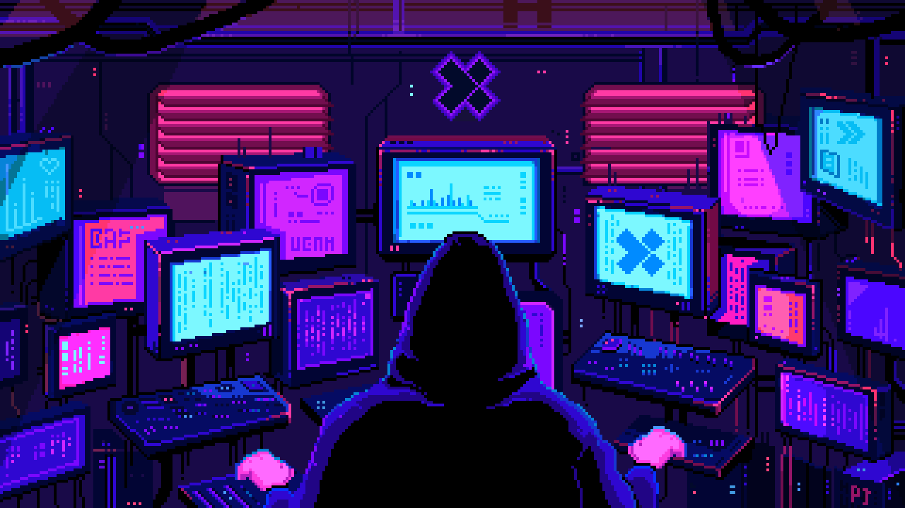

  

<h1 align="center">Muhammad Saad Haroon</h1>

🤝 I’m looking to collaborate on:

    1. Deep Learning Research
    2. Computer Vision & Image Reconstruction
    3. Universal Domain Adaptation
    4. Neural Network Optimization (Pruning, KD, FL)
    5. LLM Applications & Retrieval-Augmented Generation
    6. Generative Models (GANs, VAEs, Stable Diffusion)
    7. Data-centric AI

📧 Contact: 25100147@lums.edu.pk / saadharoonjehangir@gmail.com

  

    
    
    
  

  

  
  

  

  

<h3 align="center">🛠️ Languages & Tools</h3>

<!-- 🔹 Icons -->

  

  

<!-- 🔸 Badges -->

  <!-- ML/DL -->
  
  
  
  
  
  
  

  <!-- Data Science -->
  
  
  
  
  

  <!-- GenAI Ecosystem -->
  
  
  
  

  <!-- MLOps & Platforms -->
  
  
  
  

---

<h3 align="center" style="color: #facc15;">🚀 Featured Projects</h3>

<!-- Machine Learning / Deep Learning Projects -->
<h4 style="color: #84cc16;">Machine Learning / Deep Learning Projects</h4>
<table align="center" width="90%" style="border-spacing: 14px;">
  <tr>
    <td align="center" width="45%" style="border: 1px solid #2e2e2e; border-radius: 12px; padding: 12px;">
      <a href="https://github.com/SaadH-077/Adaptive-Entropy-Guided-Universal-Domain-Adaptation_AEG-UDA-" style="font-weight:bold; font-size: 16px;">AEG-UDA</a> 
      Entropy-based domain adaptation across CDA, ODA, OPDA, PDA
    </td>
    <td align="center" width="45%" style="border: 1px solid #2e2e2e; border-radius: 12px; padding: 12px;">
      <a href="https://github.com/SaadH-077/Road-Damage-Classification-Using-ResNet50-InceptionV3-and-VGG16-A-Deep-Learning-Approach" style="font-weight:bold; font-size: 16px;">Road Damage Classification</a> 
      Multi-label damage detection using ResNet50, InceptionV3, VGG16
    </td>
  </tr>
  <tr>
    <td align="center" width="45%" style="border: 1px solid #2e2e2e; border-radius: 12px; padding: 12px;">
      <a href="https://github.com/SaadH-077/Federated-Learning-Optimization" style="font-weight:bold; font-size: 16px;">Federated Learning Optimization</a> 
      Comparative study on Benchmarking FedAvg, FedSAM, FedGH & SCAFFOLD across edge nodes
    </td>
    <td align="center" width="45%" style="border: 1px solid #2e2e2e; border-radius: 12px; padding: 12px;">
      <a href="https://github.com/SaadH-077/DeepPruning-ATML" style="font-weight:bold; font-size: 16px;">Deep Pruning + KD</a> 
      Neural Network compression using Pruning techniques & knowledge distillation
    </td>
  </tr>
</table>

<!-- Generative AI / NLP -->
<h4 style="color: #22d3ee;">Generative AI / NLP Projects</h4>
<table align="center" width="90%" style="border-spacing: 14px;">
  <tr>
    <td align="center" width="90%" style="border: 1px solid #2e2e2e; border-radius: 12px; padding: 12px;">
      <a href="https://github.com/SaadH-077/SmartCourseAdvisor-RAG" style="font-weight:bold; font-size: 16px;">SmartCourseAdvisor-RAG</a> 
      LangChain-powered course recommender using Retrieval-Augmented Generation
    </td>
  </tr>
</table>

<!-- Vision -->
<h4 style="color: #60a5fa;">Computer Vision Projects</h4>
<table align="center" width="90%" style="border-spacing: 14px;">
  <tr>
    <td align="center" width="90%" style="border: 1px solid #2e2e2e; border-radius: 12px; padding: 12px;">
      <a href="https://github.com/SaadH-077/Vision3D-Landmark-Recon" style="font-weight:bold; font-size: 16px;">Vision3D Landmark Reconstruction</a> 
      3D landmark recon using ORB features, triangulation, and FlutterCube
    </td>
  </tr>
</table>

<!-- SE -->
<h4 style="color: #c084fc;">Software Engineering Projects</h4>
<table align="center" width="90%" style="border-spacing: 14px;">
  <tr>
    <td align="center" width="45%" style="border: 1px solid #2e2e2e; border-radius: 12px; padding: 12px;">
      <a href="https://github.com/SaadH-077/EmployNet" style="font-weight:bold; font-size: 16px;">EmployNet</a> 
      MERN-based HR portal with attendance, leave, and email automation
    </td>
    <td align="center" width="45%" style="border: 1px solid #2e2e2e; border-radius: 12px; padding: 12px;">
      <a href="https://github.com/SaadH-077/tradebiz-mern" style="font-weight:bold; font-size: 16px;">TradeBiz</a> 
      Full-stack B2B trading system with live trades & trader profile management
    </td>
  </tr>
</table>

---

  <strong><em>“Engineering intelligence isn't about building what thinks — it's about building what learns.”</em></strong>

---
