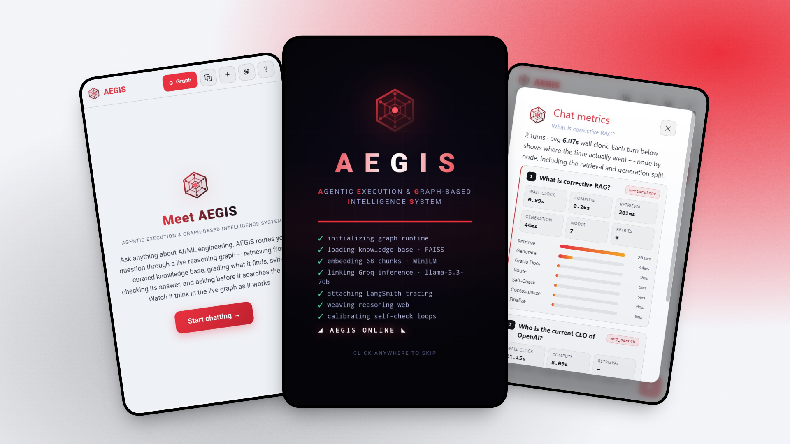

<!-- ═══════════════════════════════════════════════════════════ -->
<!--                       HEADER                                -->
<!-- ═══════════════════════════════════════════════════════════ -->

<!-- CODING GIF -->

 

 

---

## 👋 About Me

I'm an **AI Engineer** who ships — turning research-grade ideas into production systems that real users can touch. My work centers on **LLM agents, RAG, and multi-agent pipelines**, and I own the full stack around them: model logic, FastAPI backends, Next.js frontends, and cloud deployment.

- 🎓 **MSc Computer Science** @ Saarland University, Germany — focus on Machine Learning, Computer Vision & NLP
- 🏆 **BSc Computer Science** @ LUMS (Distinction, CGPA 3.67 / German 1.5), Dean's Honour List 2022–2025
- 🤖 I've designed **20+ production AI agents**, built **RAG systems with self-correction & observability**, and published GenAI research at **EACL 2026**
- 🇩🇪 Open to **AI / ML Engineering** and **Full-Stack AI** roles across Germany

---

## 🚀 Featured Projects

<!-- ───────────────────────── AEGIS ───────────────────────── -->

### 🛡️ AEGIS — Agentic Execution & Graph-based Intelligence System

> A production-grade, **self-correcting RAG agent** that visualizes its own reasoning as a live, interactive **3D graph**. Implements **Adaptive + Corrective + Self-RAG** with human-in-the-loop approval and full observability.

**What makes it senior-level:** adaptive query routing (vector store / web / direct), document relevance grading with query rewriting, groundedness + relevance self-checks with bounded retry loops, per-node latency metrics, and LangSmith LLM-as-judge evaluation — every answer is cited and auditable.

`LangGraph` · `LangChain` · `LangSmith` · `FastAPI (SSE streaming)` · `FAISS` · `Next.js + Three.js` · `Docker` · `CI/CD`

 

<!-- ───────────────────────── F1 NEXUS ───────────────────────── -->

### 🏎️ F1 Nexus — Full-Stack Formula 1 AI Analytics Platform

> A complete, cloud-deployed AI product: **live race telemetry, ML race predictions, strategy simulation, and LLM-powered post-race analysis** in one polished platform.

**Engineering highlights:** an **XGBoost** model forecasting win/podium probabilities, a **Monte-Carlo** tyre-strategy simulator, an **LLM race analyst** (Llama 3.2) with rule-based fallback, real-time OpenF1 telemetry, and automated session email reminders — Next.js 16 frontend on Vercel, FastAPI + PostgreSQL backend Dockerized on Render.

`Next.js 16` · `React 19` · `FastAPI` · `XGBoost` · `Llama 3.2 / Ollama` · `PostgreSQL` · `FastF1` · `Docker`

 

<!-- ───────────────────────── PORTFOLIO ───────────────────────── -->
### 🌐 AI Portfolio — An Interactive, Over-Engineered Showcase

> Not a template — a full **WebGL experience**: a real-time 3D neural-network particle field, a holographic rotating globe, a `Ctrl+K` command palette, a working terminal emulator, and voice-command navigation.

Built to demonstrate that I sweat the details on the frontend as much as the model layer. **Best experienced live.**

`React 18` · `Vite` · `Three.js` · `Framer Motion` · `Web Speech API` · `Tailwind CSS`

---

## 📂 Selected Work

| Project | What it is | Stack |
|---|---|---|
| **[Kahaani](https://github.com/SaadH-077/kahaani)** — *Published @ EACL 2026* | Multi-agent GenAI system for co-creative children's storytelling — LLM narrative generation + TTS + text-to-video, with Urdu support and child-safe guardrails | `LLMs` `Multimodal` `TTS/TTV` `FastAPI` |
| **[Stolen-Model Detection](https://github.com/SaadH-077/tml26-stolen-model-detection)** — *🥇 1st place* | Trustworthy-ML model-theft detector (TPR@5%FPR = 0.76) via weight-cosine, soft-logit agreement & FGSM adversarial transfer | `PyTorch` `Adversarial ML` |
| **[AEG-UDA](https://github.com/SaadH-077/Adaptive-Entropy-Guided-Universal-Domain-Adaptation_AEG-UDA-)** | Novel Universal Domain Adaptation framework unifying all four UDA regimes via adaptive entropy weighting | `PyTorch` `Domain Adaptation` |
| **[Legal-Aid](https://github.com/SaadH-077/Legal-Aid)** | Deployed RAG assistant over legal PDFs with source-attributed answers | `Mistral-7B` `LangChain` `FAISS` |
| **[Vision3D](https://github.com/SaadH-077/Vision3D-Landmark-Recon)** | 3D landmark reconstruction from 2D images — ORB/SIFT, epipolar geometry, COLMAP, interactive 3D viewer | `OpenCV` `Open3D` |
| **[FedLearn-Opt](https://github.com/SaadH-077/Federated-Learning-Optimization)** | Benchmarking FedAvg, SCAFFOLD, FedGH & FedSAM on non-IID data | `PyTorch` `Federated Learning` |

---

## 🛠️ Tech Stack

**Languages**

**LLM · Agents · RAG**

**Machine Learning & Deep Learning**

**Full-Stack & Backend**

**MLOps · Cloud · Deployment**

---

## 📊 GitHub Stats

&nbsp;

---

### Let's build something intelligent.

I'm actively looking for **AI / ML Engineering** roles in Germany — if you're hiring, let's talk.

