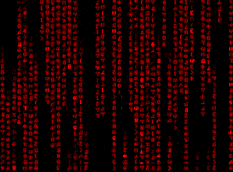
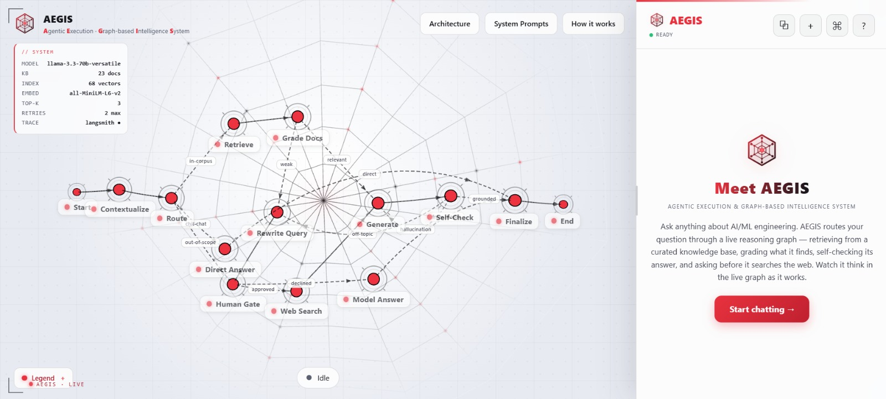
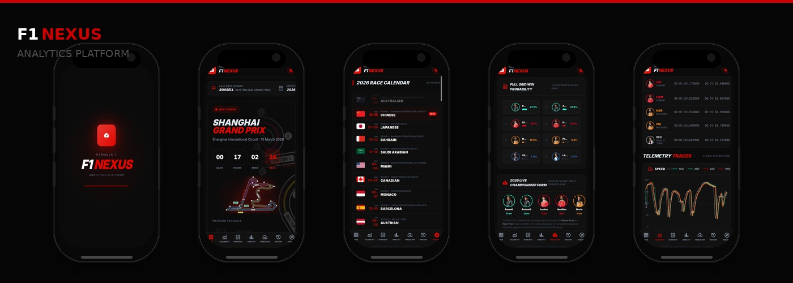

<!-- ═══════════════════════════════════════════════════════════ -->
<!--                       HEADER                                -->
<!-- ═══════════════════════════════════════════════════════════ -->

<!-- RED CODE-RAIN GIF -->

 

 

---

## 👋 About Me

I'm an **AI Engineer** who ships — I turn research-grade ideas into production systems that real users can touch. My work centers on **LLM agents, RAG, and multi-agent pipelines**, and I own the full stack around them: model logic, FastAPI backends, Next.js frontends, and cloud deployment.

- 🎓 **MSc Computer Science** @ Saarland University, Germany — focus on Machine Learning, Computer Vision & NLP
- 🏆 **BSc Computer Science** @ LUMS — Distinction, CGPA 3.67 / German 1.5, Dean's Honour List 2022–2025
- 🤖 **Shipped 20+ production AI agents** to the **Oracle AI Agent Marketplace**, published across releases **26B** (4 agents) and **26C** (16 agents) &nbsp;·&nbsp; [**View Initiative**](https://www.gosaas.ai/gosaas-agentic-ai-solutions) &nbsp;|&nbsp; [**Oracle Marketplace**](https://marketplace.oracle.com/fusion+applications/listings?solutionType=Fusion+AI+Agent&query=GoSaaS)
- 📄 **Published GenAI research** at **EACL SRW 2026** — *Kahaani: A Multimodal Co-Creative Storytelling System* &nbsp;·&nbsp; [**Read the paper**](https://aclanthology.org/2026.eacl-srw.25/)
- 🤝 Always happy to **collaborate on AI / ML projects and research**

---

## 🚀 Featured Projects

<!-- ───────────────────────── AEGIS ───────────────────────── -->
<table>
<tr><td>

</td></tr>
<tr><td>

### 🛡️ AEGIS — Agentic Execution & Graph-based Intelligence System

**A production-grade, self-correcting RAG agent that visualizes its own reasoning as a live, interactive 3D graph.**

Implements **Adaptive + Corrective + Self-RAG** in a single stateful pipeline:
- **Adaptive routing** — sends each query to the vector store, live web search, or a direct reply
- **Corrective retrieval** — grades retrieved documents, rewrites weak queries, falls back to web
- **Self-checking** — validates every answer for groundedness + relevance, loops back on failure
- **Human-in-the-loop** approval, **per-node latency metrics**, and **LangSmith LLM-as-judge** evaluation — every answer is cited and auditable

`LangGraph` · `LangChain` · `LangSmith` · `FastAPI (SSE)` · `FAISS` · `Next.js + Three.js` · `Docker` · `CI/CD`

&nbsp;

</td></tr>
</table>

<!-- ───────────────────────── F1 NEXUS ───────────────────────── -->
<table>
<tr><td>

</td></tr>
<tr><td>

### 🏎️ F1 Nexus — Full-Stack Formula 1 AI Analytics Platform

**A complete, cloud-deployed AI product: live telemetry, ML predictions, strategy simulation, and LLM analysis in one polished platform.**

- **XGBoost** model forecasting win / podium probabilities from 2024–25 race data
- **Monte-Carlo** tyre-strategy simulator for pit-stop and compound decisions
- **LLM race analyst** (Llama 3.2) generating post-race breakdowns, with a rule-based fallback
- **Real-time telemetry** (speed / throttle / brake / gear) via OpenF1, plus automated session email reminders

`Next.js 16` · `React 19` · `FastAPI` · `XGBoost` · `Llama 3.2 / Ollama` · `PostgreSQL` · `FastF1` · `Docker`

&nbsp;

</td></tr>
</table>

<!-- ───────────────────────── PORTFOLIO ───────────────────────── -->
<table>
<tr><td>

### 🌐 AI Portfolio — An Interactive WebGL Showcase

**Not a template — a full WebGL experience engineered from scratch.** A real-time 3D neural-network particle field, a holographic rotating globe, a `Ctrl+K` command palette, a working terminal emulator, and voice-command navigation.

Built to prove I sweat the details on the frontend as much as the model layer. **Best experienced live.**

`React 18` · `Vite` · `Three.js` · `Framer Motion` · `Web Speech API` · `Tailwind CSS`

&nbsp;

</td></tr>
</table>

---

## 📂 More Projects by Domain

**🤖 Agentic AI · LLMs · RAG**
- [**AEGIS**](https://github.com/SaadH-077/aegis-agentic-rag) — Adaptive + Corrective + Self-RAG agent with a live 3D reasoning graph
- [**Legal-Aid**](https://github.com/SaadH-077/Legal-Aid) — Deployed RAG assistant over legal PDFs with source-attributed answers `Mistral-7B · FAISS`
- [**SmartCourse Advisor**](https://github.com/SaadH-077/SmartCourseAdvisor-RAG) — Multi-turn conversational RAG for university course recommendations `LangChain · ChromaDB`

**🎨 Generative AI & NLP**
- [**Kahaani**](https://github.com/SaadH-077/kahaani) — Multimodal GenAI storytelling (LLM + TTS + text-to-video), *published @ EACL 2026*
- [**F1 Nexus**](https://github.com/SaadH-077/F1-Nexus) — LLM-powered post-race analysis inside a full-stack analytics platform

**🧠 Machine Learning Research**
- [**AEG-UDA**](https://github.com/SaadH-077/Adaptive-Entropy-Guided-Universal-Domain-Adaptation_AEG-UDA-) — Novel Universal Domain Adaptation framework unifying all four UDA regimes `PyTorch`
- [**Stolen-Model Detection**](https://github.com/SaadH-077/tml26-stolen-model-detection) — Trustworthy-ML model-theft detector, **🥇 1st place** (TPR@5%FPR = 0.76)
- [**FedLearn-Opt**](https://github.com/SaadH-077/Federated-Learning-Optimization) — Benchmarking FedAvg, SCAFFOLD, FedGH & FedSAM on non-IID data

**👁️ Computer Vision**
- [**Vision3D**](https://github.com/SaadH-077/Vision3D-Landmark-Recon) — 3D landmark reconstruction from 2D images (ORB/SIFT, epipolar geometry, COLMAP)
- [**Road-Damage Classification**](https://github.com/SaadH-077/Road-Damage-Classification-Using-ResNet50-InceptionV3-and-VGG16-A-Deep-Learning-Approach) — Multi-label damage detection across ResNet50 / InceptionV3 / VGG16

**🌐 Full-Stack Engineering**
- [**AI Portfolio**](https://github.com/SaadH-077/saad-ai-portfolio) — WebGL portfolio with 3D neural field, command palette & voice nav `React · Three.js`
- [**EmployNet**](https://github.com/SaadH-077/EmployNet) — HR self-service portal: attendance, leave & payroll `MERN`
- [**TradeBiz**](https://github.com/SaadH-077/tradebiz-mern) — Real-time trading/bartering platform with live offers `MERN · Socket.IO`

---

## 🛠️ Tech Stack

**Languages**

**LLM Engineering · Agents · Prompting**

**RAG & Vector Search**

**Machine Learning & Deep Learning**

**Computer Vision**

**MLOps · Deployment · Observability**

**Full-Stack & Backend**

**Cloud & Data**

-1a1a1a?style=for-the-badge&logo=amazonaws&logoColor=E63946)

---

## 📊 GitHub Stats

&nbsp;

---

### Let's build something intelligent.

Always open to **collaborating on AI / ML projects and research** — if you're working on something interesting, reach out.

